# 📊 Use Case Diagram Prompt for ChatGPT

Copy and paste this entire prompt to ChatGPT to generate your SmartFix use case diagram.

---

## 🎯 PROMPT FOR CHATGPT

```
Please create a detailed UML Use Case Diagram for the SmartFix (Intelligent Corex) system - an AI-powered device repair shop management system.

## SYSTEM OVERVIEW
SmartFix is a comprehensive repair shop management system with AI-powered features for inventory management, repair assistance, and business analytics.

## ACTORS (4 Primary Actors)

1. **Admin** (System Administrator)
   - Has full system access
   - Manages all users and system settings

2. **Inventory Manager**
   - Manages stock and inventory
   - Handles AI-powered stock recommendations

3. **Sales Representative**
   - Processes sales transactions
   - Manages customer warranties
   - Coordinates repair services

4. **Technician**
   - Performs device repairs
   - Uses AI repair assistant
   - Records repair knowledge

## USE CASES BY ACTOR

### ADMIN USE CASES (26 use cases)

#### Dashboard & Overview
1. View System Dashboard
2. View System Analytics

#### Repair Management
3. View All Repair Tasks
4. Assign Repair Tasks to Technicians
5. Monitor Repair Progress
6. View Repair History
7. View Repair Analytics
8. Manage Technicians
9. Approve Spare Part Requests
10. View Technician Performance Metrics

#### Inventory Management
11. Manage Inventory Stock
12. Add/Edit/Delete Inventory Items
13. View Stock Out Items
14. Handle Customer Product Requests
15. View Stock Alerts
16. View AI Stock Recommendations
17. Generate QR Codes for Products
18. View Inventory Reports

#### Sales Management
19. Process Sales Transactions
20. View Sales History
21. View Sales Analytics
22. Manage Customer Warranties
23. Coordinate Repair Services

#### System Administration
24. Manage User Accounts
25. Approve New User Registrations
26. Manage Product Categories
27. Generate Business Reports
28. View System Notifications
29. Configure System Settings

### INVENTORY MANAGER USE CASES (10 use cases)

1. View Inventory Dashboard
2. Manage Inventory Stock
3. Add/Edit/Delete Inventory Items
4. View Stock Out Items
5. Handle Customer Product Requests
6. View Stock Alerts (Low Stock Notifications)
7. Browse Inventory
8. View AI Stock Recommendations
9. Generate/Manage QR Codes
10. View Inventory Reports

### SALES REPRESENTATIVE USE CASES (10 use cases)

1. View Sales Dashboard
2. Process New Sale Transaction
3. Browse Available Products
4. Handle Customer Product Requests
5. View Sales History
6. Coordinate Repair Services
7. View Stock Availability
8. Manage Customer Warranties
9. Generate Sales Reports
10. View Notifications

### TECHNICIAN USE CASES (4 use cases)

1. View Technician Dashboard
2. View Assigned Repair Tasks
3. Update Repair Task Status
4. Use AI Repair Assistant
   - Analyze Device Symptoms
   - View Similar Past Cases
   - Get Repair Recommendations
   - View Component Predictions
5. Record Repair Knowledge
6. View Task Notifications

## SYSTEM USE CASES (AI & Backend)

### AI System (External Actor)
1. Analyze Device Symptoms
2. Find Similar Repair Cases
3. Generate Repair Recommendations
4. Predict Required Components
5. Detect Repair Patterns
6. Generate Stock Recommendations
7. Forecast Demand

### Authentication System
1. Login with OTP
2. Send OTP Email
3. Verify OTP Code
4. Logout

## RELATIONSHIPS

### Generalization (Inheritance)
- Admin inherits all capabilities from: Inventory Manager, Sales Representative, Technician

### Include Relationships
- "Process Sale" includes "Check Stock Availability"
- "Assign Repair Task" includes "Notify Technician"
- "Use AI Repair Assistant" includes "Analyze Device Symptoms"
- "Manage Inventory" includes "Update Stock Levels"
- "Login" includes "Send OTP Email"
- "View Stock Alerts" includes "Check Reorder Points"

### Extend Relationships
- "View Repair History" extends to "Generate Repair Report"
- "Process Sale" extends to "Register Warranty"
- "Complete Repair Task" extends to "Record Repair Knowledge"
- "View Stock Out Items" extends to "Create Purchase Order"
- "Handle Customer Request" extends to "Notify Customer When Available"

## SYSTEM BOUNDARY
System Name: **SmartFix (Intelligent Corex)**
Subtitle: AI-Powered Device Repair Management System

## DIAGRAM REQUIREMENTS

1. **Layout**: Use a clear, organized layout with actors on the left and right sides
2. **Grouping**: Group related use cases together (Repair, Inventory, Sales, Admin)
3. **Colors**: Use different colors for different modules if possible
4. **Relationships**: Show all include, extend, and generalization relationships
5. **AI System**: Show AI System as a separate external actor on the right side
6. **Clarity**: Ensure all text is readable and use cases don't overlap

## ADDITIONAL NOTES

- The system has 5 main modules: Dashboard, Repair Management, Inventory Management, Sales Management, and AI Intelligence
- AI features are integrated throughout the system
- All users must authenticate via OTP email verification
- Admin has complete oversight of all operations
- Each role has a focused set of responsibilities

Please create a professional UML Use Case Diagram with proper notation, clear relationships, and organized layout.
```

---

## 📋 ALTERNATIVE: DETAILED USE CASE LIST FOR DRAWING TOOLS

If you're using a drawing tool like Draw.io, Lucidchart, or PlantUML, use this structured format:

### ACTORS
```
1. Admin (stick figure)
2. Inventory Manager (stick figure)
3. Sales Representative (stick figure)
4. Technician (stick figure)
5. AI System (stick figure - external)
6. Email System (stick figure - external)
```

### USE CASES (Ovals inside system boundary)

#### Module 1: Authentication
```
- Login with OTP
- Send OTP Email (include)
- Verify OTP
- Logout
```

#### Module 2: Dashboard
```
- View Dashboard
- View Analytics
- View Notifications
```

#### Module 3: Repair Management
```
- View Repair Tasks
- Assign Repair Task
- Update Repair Status
- Complete Repair
- View Repair History
- Use AI Repair Assistant
  - Analyze Symptoms (include)
  - View Similar Cases (include)
  - Get Recommendations (include)
- Record Repair Knowledge
- View Technician Performance
- Manage Technicians
- Request Spare Parts
```

#### Module 4: Inventory Management
```
- Manage Inventory Stock
- Add Inventory Item
- Edit Inventory Item
- Delete Inventory Item
- View Stock Out Items
- Handle Customer Requests
- View Stock Alerts
- View AI Recommendations
- Generate QR Codes
- View Inventory Reports
- Browse Inventory
```

#### Module 5: Sales Management
```
- Process Sale
  - Check Stock (include)
  - Register Warranty (extend)
- View Sales History
- View Sales Analytics
- Browse Products
- Manage Warranties
- Coordinate Repairs
- Generate Sales Reports
```

#### Module 6: System Administration
```
- Manage Users
- Approve User Registration
- Manage Categories
- Generate Reports
- Configure Settings
```

### RELATIONSHIPS

#### Generalization (Admin inherits from all)
```
Admin --|> Inventory Manager
Admin --|> Sales Representative
Admin --|> Technician
```

#### Include Relationships
```
"Process Sale" --include--> "Check Stock Availability"
"Assign Repair Task" --include--> "Send Notification"
"Use AI Assistant" --include--> "Analyze Symptoms"
"Login" --include--> "Send OTP Email"
"Manage Inventory" --include--> "Update Stock Levels"
```

#### Extend Relationships
```
"View Repair History" <--extend-- "Generate Repair Report"
"Process Sale" <--extend-- "Register Warranty"
"Complete Repair" <--extend-- "Record Knowledge"
"View Stock Out" <--extend-- "Create Purchase Order"
```

#### Actor-Use Case Associations
```
Admin ----------- (All Use Cases)
Inventory Manager ----------- (Inventory Use Cases)
Sales Representative ----------- (Sales Use Cases)
Technician ----------- (Repair Use Cases)
AI System ----------- (AI Analysis Use Cases)
Email System ----------- (Send OTP Email)
```

---

## 🎨 PLANTUML CODE (For Automated Generation)

If you want to use PlantUML, here's the code:

```plantuml
@startuml SmartFix_UseCase_Diagram

left to right direction
skinparam packageStyle rectangle

actor "Admin" as admin
actor "Inventory\nManager" as inventory
actor "Sales\nRepresentative" as sales
actor "Technician" as tech
actor "AI System" as ai
actor "Email System" as email

rectangle "SmartFix System\n(Intelligent Corex)" {
  
  package "Authentication" {
    usecase "Login with OTP" as login
    usecase "Send OTP Email" as sendOTP
    usecase "Verify OTP" as verifyOTP
    usecase "Logout" as logout
  }
  
  package "Dashboard" {
    usecase "View Dashboard" as dashboard
    usecase "View Analytics" as analytics
  }
  
  package "Repair Management" {
    usecase "View Repair Tasks" as viewTasks
    usecase "Assign Repair Task" as assignTask
    usecase "Update Repair Status" as updateStatus
    usecase "Use AI Repair Assistant" as aiAssist
    usecase "Analyze Device Symptoms" as analyzeSymptoms
    usecase "View Similar Cases" as similarCases
    usecase "Get Repair Recommendations" as recommendations
    usecase "Record Repair Knowledge" as recordKnowledge
    usecase "View Repair History" as repairHistory
    usecase "Manage Technicians" as manageTechs
    usecase "View Performance Metrics" as performance
  }
  
  package "Inventory Management" {
    usecase "Manage Inventory Stock" as manageStock
    usecase "Add/Edit/Delete Items" as editItems
    usecase "View Stock Out Items" as stockOut
    usecase "Handle Customer Requests" as customerReq
    usecase "View Stock Alerts" as stockAlerts
    usecase "View AI Stock Recommendations" as aiStock
    usecase "Generate QR Codes" as qrCodes
    usecase "View Inventory Reports" as invReports
  }
  
  package "Sales Management" {
    usecase "Process Sale" as processSale
    usecase "Check Stock Availability" as checkStock
    usecase "View Sales History" as salesHistory
    usecase "Manage Warranties" as warranties
    usecase "Browse Products" as browseProducts
    usecase "Generate Sales Reports" as salesReports
  }
  
  package "System Administration" {
    usecase "Manage Users" as manageUsers
    usecase "Approve User Registration" as approveUsers
    usecase "Manage Categories" as categories
    usecase "Configure Settings" as settings
  }
}

' Actor relationships
admin --|> inventory
admin --|> sales
admin --|> tech

' Admin connections
admin -- dashboard
admin -- analytics
admin -- viewTasks
admin -- assignTask
admin -- repairHistory
admin -- manageTechs
admin -- performance
admin -- manageStock
admin -- stockOut
admin -- customerReq
admin -- stockAlerts
admin -- aiStock
admin -- qrCodes
admin -- invReports
admin -- processSale
admin -- salesHistory
admin -- warranties
admin -- salesReports
admin -- manageUsers
admin -- approveUsers
admin -- categories
admin -- settings

' Inventory Manager connections
inventory -- dashboard
inventory -- manageStock
inventory -- editItems
inventory -- stockOut
inventory -- customerReq
inventory -- stockAlerts
inventory -- aiStock
inventory -- qrCodes
inventory -- invReports

' Sales Representative connections
sales -- dashboard
sales -- processSale
sales -- browseProducts
sales -- customerReq
sales -- salesHistory
sales -- warranties
sales -- salesReports

' Technician connections
tech -- dashboard
tech -- viewTasks
tech -- updateStatus
tech -- aiAssist
tech -- recordKnowledge

' AI System connections
ai -- analyzeSymptoms
ai -- similarCases
ai -- recommendations
ai -- aiStock

' Email System connections
email -- sendOTP

' All users login
admin -- login
inventory -- login
sales -- login
tech -- login

' Include relationships
login .> sendOTP : <<include>>
login .> verifyOTP : <<include>>
processSale .> checkStock : <<include>>
aiAssist .> analyzeSymptoms : <<include>>
aiAssist .> similarCases : <<include>>
aiAssist .> recommendations : <<include>>

' Extend relationships
repairHistory <. recordKnowledge : <<extend>>
processSale <. warranties : <<extend>>

@enduml
```



---

## 🖼️ VISUAL LAYOUT SUGGESTION

```
┌─────────────────────────────────────────────────────────────────┐
│                    SmartFix System Boundary                      │
│                                                                   │
│  Admin ────────┐                                                 │
│                │                                                  │
│  Inventory ────┼──── [Dashboard Module]                          │
│  Manager       │                                                  │
│                │                                                  │
│  Sales ────────┼──── [Repair Management Module]                  │
│  Rep           │     - View Tasks                                │
│                │     - AI Assistant ──────────────── AI System   │
│  Technician ───┼──── - Record Knowledge                          │
│                │                                                  │
│                ├──── [Inventory Management Module]               │
│                │     - Manage Stock                              │
│                │     - AI Recommendations ──────── AI System     │
│                │     - QR Codes                                  │
│                │                                                  │
│                ├──── [Sales Management Module]                   │
│                │     - Process Sale                              │
│                │     - Warranties                                │
│                │                                                  │
│                └──── [System Administration]                     │
│                      - Manage Users                              │
│                      - Settings                                  │
│                                                                   │
│  Email System ────── [Send OTP]                                  │
│                                                                   │
└─────────────────────────────────────────────────────────────────┘
```

---

## 📝 TIPS FOR CHATGPT

1. **Ask ChatGPT to**: "Create this as a Mermaid diagram" or "Create this as PlantUML code"
2. **For better results**: Ask ChatGPT to generate the diagram in stages (actors first, then use cases, then relationships)
3. **Refinement**: You can ask ChatGPT to adjust colors, layout, or add more details
4. **Export**: Ask ChatGPT to provide the code in a format you can paste into your preferred tool

---

## 🎯 QUICK COPY-PASTE PROMPTS

### Option 1: Simple Request
```
Create a UML Use Case Diagram for SmartFix system with these actors: Admin, Inventory Manager, Sales Representative, Technician, AI System. Include use cases for: Dashboard, Repair Management (with AI Assistant), Inventory Management (with AI Recommendations), Sales Management, and System Administration. Show generalization where Admin inherits from all other roles.
```

### Option 2: Detailed Request
```
[Copy the entire "PROMPT FOR CHATGPT" section above]
```

### Option 3: PlantUML Request
```
Generate PlantUML code for a Use Case Diagram of SmartFix system with 4 user roles (Admin, Inventory Manager, Sales Rep, Technician) and 5 modules (Dashboard, Repair, Inventory, Sales, Admin). Include AI System as external actor. Show Admin inheriting from all roles.
```

---

## 📚 REFERENCE DOCUMENTS

For more details about the system, refer to:
- `USER_SIDEBAR_TASKS_SUMMARY.md` - Complete list of all user tasks
- `COMPLETE_SYSTEM_SUMMARY.md` - Full system overview
- `PROJECT_POSITIONING.md` - System architecture and features

---

**Generated**: May 24, 2026  
**System**: SmartFix (Intelligent Corex)  
**Purpose**: Use Case Diagram Generation Guide
